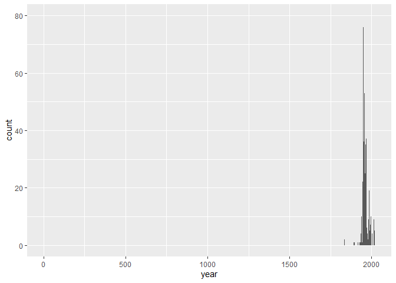
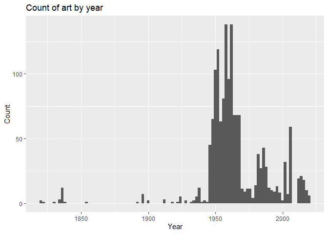

Lab 07 - University of Edinburgh Art Collection
================
Insert your name here
Insert date here

### Load packages and data

``` r
library(tidyverse) 
```

    ## Warning: package 'ggplot2' was built under R version 3.6.3

    ## Warning: package 'tidyr' was built under R version 3.6.2

    ## Warning: package 'dplyr' was built under R version 3.6.3

    ## Warning: package 'stringr' was built under R version 3.6.3

``` r
library(skimr)
```

    ## Warning: package 'skimr' was built under R version 3.6.3

``` r
library(stringr)
```

``` r
# Remove eval = FALSE or set it to TRUE once data is ready to be loaded
uoe_art <- read_csv("data/uoe-art.csv")
```

### Exercise 10

``` r
uoe_art <- uoe_art %>%
  separate(title, into = c("title", "date"), sep = "\\(") %>%
  mutate(year = str_remove(date, "\\)") %>% as.numeric()) %>%
  select(title, artist, year, link)
```

    ## Warning: Expected 2 pieces. Additional pieces discarded in 39 rows [145, 590,
    ## 613, 634, 661, 662, 703, 830, 1036, 1172, 1173, 1176, 1409, 1463, 1522, 1648,
    ## 1653, 1675, 1736, 1870, ...].

    ## Warning: Expected 2 pieces. Missing pieces filled with `NA` in 618 rows [22, 23,
    ## 25, 26, 27, 28, 29, 30, 36, 37, 38, 39, 40, 41, 47, 48, 51, 52, 54, 70, ...].

    ## Warning in str_remove(date, "\\)") %>% as.numeric(): NAs introduced by coercion

The warning is fine because it’s just saying it’s filling in the missing
dates with NA.

### Exercise 11

``` r
skim(uoe_art)
```

|                                                  |          |
| :----------------------------------------------- | :------- |
| Name                                             | uoe\_art |
| Number of rows                                   | 2910     |
| Number of columns                                | 4        |
| \_\_\_\_\_\_\_\_\_\_\_\_\_\_\_\_\_\_\_\_\_\_\_   |          |
| Column type frequency:                           |          |
| character                                        | 3        |
| numeric                                          | 1        |
| \_\_\_\_\_\_\_\_\_\_\_\_\_\_\_\_\_\_\_\_\_\_\_\_ |          |
| Group variables                                  | None     |

Data summary

**Variable type: character**

| skim\_variable | n\_missing | complete\_rate | min | max | empty | n\_unique | whitespace |
| :------------- | ---------: | -------------: | --: | --: | ----: | --------: | ---------: |
| title          |          1 |           1.00 |   0 |  95 |     8 |      1329 |          0 |
| artist         |        115 |           0.96 |   2 |  55 |     0 |      1090 |          0 |
| link           |          0 |           1.00 |  57 |  60 |     0 |      2910 |          0 |

**Variable type: numeric**

| skim\_variable  |   n\_missing |   complete\_rate |       mean |       sd |    p0 |     p25 |    p50 |     p75 |    p100 | hist  |
| :-------------- | -----------: | ---------------: | ---------: | -------: | ----: | ------: | -----: | ------: | ------: | :---- |
| year            |         1369 |             0.53 |    1964.04 |    56.13 |     2 |    1953 |   1961 |    1977 |    2020 | ▁▁▁▁▇ |
| 1 has a missing | title, 115 h | ave missing arti | sts, 0 hav | e missin | g lin | ks, and | 1369 h | ave mis | sing ye | ars.  |

### Exercise 12

``` r
ggplot(data = uoe_art, aes(x = year)) +
  geom_histogram(binwidth = 1)
```

    ## Warning: Removed 1369 rows containing non-finite values (stat_bin).

<!-- -->

I just did table(uoe\_art$year) and found that there’s a datapoint at
year 2, which is what is messing with this graph. Let’s look at it.

``` r
uoe_art %>% 
  filter(year == 2)
```

    ## # A tibble: 1 x 4
    ##   title        artist       year link                                           
    ##   <chr>        <chr>       <dbl> <chr>                                          
    ## 1 "Death Mask~ H. Dempsha~     2 https://collections.ed.ac.uk/art/record/21649?~

Okay, so it’s called Death Mask(2) and that’s where the confusion is.
Let’s change it to the real year and name.

\#\#Exercise 13

``` r
uoe_art$year[uoe_art$year == 2] <- 1964
uoe_art$title[uoe_art$title == "Death Mask"] <- "Death Mask(2)"
```

Just checked with table and it’s correct. Now we’ll redo the histogram.

``` r
ggplot(data = uoe_art, aes(x = year)) +
  geom_histogram(binwidth = 2) +
  labs(x = "Year", y = "Count", title = "Count of art by year")
```

    ## Warning: Removed 1369 rows containing non-finite values (stat_bin).

<!-- --> \#\# Exercise 14

``` r
uoe_art %>%
  count(artist) %>%
  arrange(desc(n))
```

    ## # A tibble: 1,091 x 2
    ##    artist               n
    ##    <chr>            <int>
    ##  1 Unknown            350
    ##  2 Emma Gillies       148
    ##  3 <NA>               115
    ##  4 John Bellany        22
    ##  5 Ann F Ward          19
    ##  6 Boris Bucan         17
    ##  7 Marjorie Wallace    17
    ##  8 Gordon Bryce        16
    ##  9 William Gillon      16
    ## 10 Zygmunt Bukowski    16
    ## # ... with 1,081 more rows

Besides the prominent “Unknown,” Emma Gillies is byfar the most featured
artist. My guess for why this museum has so much of her work is that
she’s from Edinburgh.

## Exercise 15

``` r
uoe_art %>% 
 filter(str_detect(title, fixed('child', ignore_case = TRUE))) 
```

    ## # A tibble: 10 x 4
    ##    title                           artist          year link                    
    ##    <chr>                           <chr>          <dbl> <chr>                   
    ##  1 Virgin and Child                Unknown           NA https://collections.ed.~
    ##  2 "Virgin and Child "             Unknown           NA https://collections.ed.~
    ##  3 "Virgin and Child "             Unknown           NA https://collections.ed.~
    ##  4 Child's chinese headdress       Unknown           NA https://collections.ed.~
    ##  5 Child's collar. Chinese         Unknown           NA https://collections.ed.~
    ##  6 The Sun Dissolves while Man Lo~ Eduardo Luigi~    NA https://collections.ed.~
    ##  7 "Untitled - Portrait of a Woma~ William Gillon    NA https://collections.ed.~
    ##  8 "Untitled - Children Playing "  Monika L I Ue~  1963 https://collections.ed.~
    ##  9 "The Children's Hour "          Eduardo Luigi~    NA https://collections.ed.~
    ## 10 "Woman with Child and Still Li~ Catherine I. ~  1938 https://collections.ed.~

There are 10 pieces of art with child in the title.
